## Nome da Solução
### EBA
#### (André Hutzler, Enzo Bressane, Felipe Braga, Felipe Spina, Gabriel Coletto, Laura Bueno, Vitoria Novaes)

## Sumário
[1. Introdução](#c1)

[2. Objetivos e Justificativa](#c2)

[3. Metodologia](#c3)

[4. Desenvolvimento e Resultados](#c4)

[5. Conclusões e Recomendações](#c5)

[6. Referências](#c6)

[Anexos](#attachments)


## <a name="c1"></a>1. Introdução

&emsp;&emsp;A PowerCO é uma companhia europeia de produção de energia que está em quarto lugar no ranking de maiores empresas do planeta e em terceiro na competição entre as maiores geradoras de energia. Sua área de atuação se encontra espalhada pelo mundo, abrangendo diversos países, e a marca já está consolidada no mercado.


## <a name="c2"></a>2. Objetivos e Justificativa
### 2.1 Objetivos

&emsp;&emsp;Após a reestruturação da marca nos anos 2000, seu novo e atual objetivo é transformar a forma com que a energia é produzida para as pessoas e para o planeta. A meta é sustentada pela ambição da companhia em se tornar neutra em carbono até 2050 ou antes. 


### 2.2 Proposta de solução

&emsp;&emsp;A proposta de solução consiste em desenvolver um modelo preditivo para identificar clientes que têm maior probabilidade de cancelar serviços. Esse modelo também busca 
identificar as principais razões por trás desse comportamento, com o objetivo de reduzir o número de cancelamentos (churn) e aumentar a lucratividade da empresa. Através de estratégias direcionadas, como promoções específicas, melhorias no atendimento ou ajustes de preços, a empresa poderá reter clientes valiosos e diminuir os custos associados à aquisição de novos clientes. A implementação do modelo será feita por meio de análise de dados e aprendizado de máquina, disponibilizada em uma plataforma online.


### 2.3 Justificativa

&emsp;&emsp;A PowerCo é uma empresa grande e que precisa melhorar a sua retenção de clientes. 
A solução proposta alivia as dores da PowerCo trazendo mais eficiência na sua operação. 
Ela é ideal para ajudar na redução de churn e se diferencia pela sua estratégia e accuracy.


## <a name="c3"></a>3. Metodologia

&emsp;&emsp;No projeto da PowerCo, utilizamos a Metodologia CRISP-DM e suas etapas foram seguidas para atender às demandas do negócio. Inicialmente, houve o entendimento do negócio, onde foi alcançada uma compreensão das necessidades empresariais, juntamente com a importância de definir o problema, suas implicações, metas e critérios específicos para o projeto. Em seguida, prosseguiu-se para o entendimento dos dados, na qual se coletaram e analisaram dados pertinentes para a análise do problema, identificando fontes disponíveis, realizando avaliações iniciais de qualidade, quantidade e relevância desses dados em relação ao problema. Completada essa segunda fase, entrou-se na etapa de preparação de dados, em que os dados brutos coletados foram devidamente preparados para a fase de modelagem, passando por um processo abrangente de limpeza, transformações, tratamento de valores ausentes e codificação de variáveis, visando a sua posterior utilização na modelagem. Com a preparação de dados finalizada, a equipe transitou para a fase de modelagem, na qual foram selecionados e aplicados diversos algoritmos de modelagem supervisionada aos dados preparados na etapa anterior, com o intuito de treinar diferentes modelos por meio de técnicas de aprendizado de máquina, seguido pela avaliação de seu desempenho com métricas apropriadas. Em seguida, avançou-se para a etapa de avaliação, na qual os modelos gerados foram minuciosamente examinados, envolvendo a análise meticulosa das métricas de desempenho, permitindo a comparação e contrastação dos modelos para determinar qual deles se mostrou mais adequado para solucionar o problema em questão. Concluída a fase de avaliação, a equipe encaminhou-se para a etapa de implantação, na qual o modelo apropriado foi selecionado, avaliado e preparado para ser efetivamente implementado na empresa. Por fim, chegou-se à última fase, o gerenciamento, que compreende o monitoramento contínuo e os ajustes necessários no desempenho do modelo implantado, com a avaliação constante de seu desempenho em relação aos dados reais, à medida que novos dados eram coletados, a fim de manter sua eficácia ao longo do tempo.


## <a name="c4"></a>4. Desenvolvimento e Resultados
### 4.1. Compreensão do Problema
#### 4.1.1. Contexto da indústria 

&emsp;&emsp;A indústria europeia de energia passou por uma série de transformações significativas nas últimas décadas devido a fatores como mudanças regulatórias, avanços tecnológicos e crescente conscientização sobre a sustentabilidade. 
A transição energética para fontes mais limpas e renováveis, juntamente com a digitalização da infraestrutura, tem impactado profundamente os principais players e modelos de negócio no setor.
Os principais players são as empresas de energia tradicionais, empresas de energia renovável e empresas de tecnologia. O modelo de negócios do cenário se dá por geração distribuída - onde indivíduos e empresas podem gerar e consumir sua própria energia -, armazenamento de energia, serviços de gerenciamento de energia - serviços de otimização de consumo energético, identificando o padrão e reduzindo custos. Já as tendências em Modelos Preditivos, estão mais inclinadas à previsão de demanda, manutenção preditiva, otimização de portfólio, comercialização de energia e integração de dados.
Segue a análise das 5 Forças de Porter presente na figura 01.

Figura 01 - 5 Forças de Porter
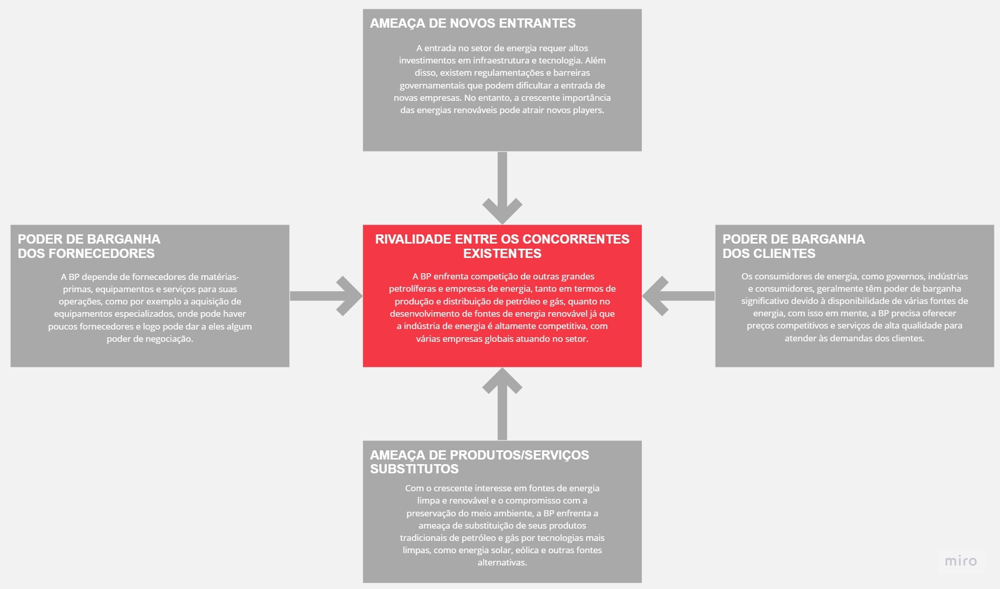
Fonte: Autoria Própria

&emsp;&emsp;Com isso, o cenário atual da indústria europeia de energia ilustra um período de renovação e adaptação. O setor está evoluindo, diante de fatores externos e internos, visando abraçar tecnologias emergentes e modelos de negócios inovadores. A ênfase na sustentabilidade, refletida na transição para fontes de energia renováveis, e a digitalização da infraestrutura, demonstra a necessidade de um futuro energético mais limpo e eficiente. Os modelos preditivos emergentes oferecem oportunidades para otimizar operações, prever demandas e garantir uma gestão energética mais inteligente.

#### 4.1.2. Análise SWOT 

&emsp;&emsp;A Matriz SWOT¹ é uma ferramenta estratégica essencial para compreender o ambiente competitivo em que uma empresa está inserida, guiando-a na tomada de decisões mais assertivas e no delineamento de suas estratégias. Conforme citado pela instituição UFABC Jr., ela "é uma ferramenta voltada à análise de cenários para decisões, levando em conta fatores internos e externos que podem influenciar positiva ou negativamente o futuro de um negócio".

&emsp;&emsp;No projeto da PowerCo, a matriz SWOT foi utilizada para avaliar e planejar estrategicamente, identificando as forças, fraquezas, oportunidades e ameaças do projeto para auxiliar o grupo na tomada de decisões mais embasadas e eficazes ao longo do ciclo do projeto. A seguir está a imagem da análise SWOT feita presente na figura 02:


Figura 02 - Análise SWOT
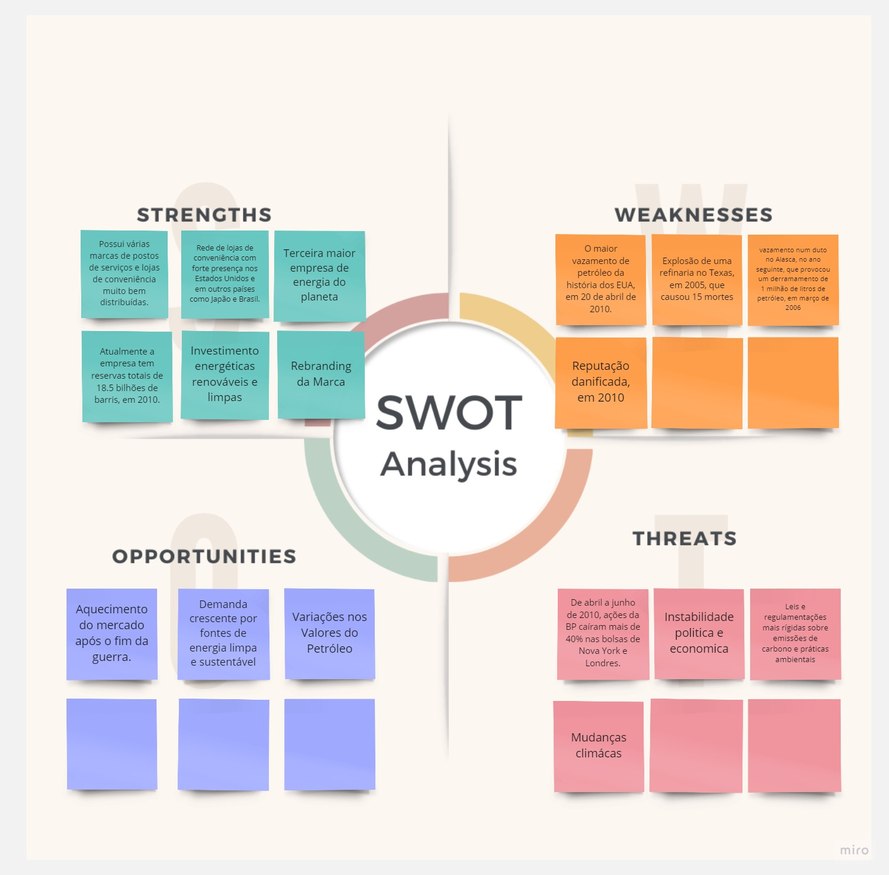
Fonte: Autoria Própria

&emsp;&emsp;Em resumo, a Matriz SWOT no projeto da PowerCo destaca a importância de realizar uma análise estratégica aprofundada. Essa análise é crucial para assegurar decisões bem fundamentadas e otimizar o desempenho do projeto. Através desta ferramenta, é possível não apenas entender o cenário em que a empresa está inserida, mas também estabelecer um roteiro claro para enfrentar desafios futuros e capitalizar seus pontos fortes.

#### 4.1.3. Planejamento Geral da Solução

a) O conjunto de dados fornecido pela empresa de energia inclui informações sobre os clientes, 
como a continuidade ou cancelamento de contratos (churn), canais de venda utilizados, consumo 
de eletricidade e gás, e detalhes contratuais específicos. Além disso, abrange previsões de 
consumo, indicadores financeiros como margens brutas e líquidas, variações nos preços da energia 
e descontos aplicados nas faturas. Também contempla informações sobre o relacionamento do cliente 
com a empresa, como a duração desse vínculo e o envolvimento em campanhas promocionais.

b) A proposta de solução visa desenvolver um modelo preditivo para identificar os clientes com maior
 risco de cancelar serviços e entender as razões deste comportamento. O objetivo é reduzir os cancelamentos
  e aumentar a lucratividade da empresa. Para alcançar isso, serão utilizadas estratégias como promoções, 
  melhorias no atendimento e ajustes de preços, com o intuito de reter clientes e diminuir os custos de 
  aquisição de novos. A implementação será realizada através da análise de dados e aprendizado de máquina, 
  e estará disponível em uma plataforma online.

c) A tarefa definida envolve a criação de um modelo de classificação. Esse modelo tem como meta detectar 
quais clientes têm maior probabilidade de churn seus serviços, utilizando dados como o histórico de preços, 
informações de cadastro e registros anteriores de cancelamentos. Assim, o modelo irá separar os clientes em 
diferentes grupos, como aqueles que são mais propensos ao churn e os que não são, caracterizando a tarefa 
como uma de classificação.

d) A solução proposta consiste em um modelo preditivo para identificar clientes propensos ao churn, usando 
informações como histórico de preços e cadastro. O modelo não apenas apontará quais clientes são mais propensos 
ao cancelamento, mas também fornecerá insights sobre as principais alavancas responsáveis, como descontos. Ele 
será usado para simular o impacto de diferentes estratégias na redução do churn e nos resultados financeiros da empresa.

e) Os benefícios, incluindo a identificação precoce de clientes estão propensos ao churn, permitindo ações 
proativas para retenção. Ela fornece insights sobre os fatores que influenciam o churn e permite simulações para 
avaliar estratégias como descontos. Essa abordagem facilita a tomada de decisões mais informadas, ajuda na customização 
de ofertas para atender às necessidades específicas dos clientes, e tem potencial para aumentar a lealdade, a satisfação 
do cliente e, consequentemente, a rentabilidade da empresa.

f) O critério de sucesso para a solução proposta estará centrado na capacidade do modelo em identificar com precisão 
os clientes propensos ao churn e em fornecer informações corretas sobre as alavancas responsáveis. As métricas 
utilizadas para avaliar esse sucesso podem incluir a acurácia, que mede a porcentagem de previsões corretas, a precisão 
e o recall, que se concentram na proporção de verdadeiros positivos, e o F1-Score e AUC-ROC, que oferecem uma visão 
equilibrada da performance do modelo. A escolha dessas métricas deverá alinhar-se com os objetivos específicos do projeto 
e as necessidades da empresa.

&emsp;&emsp;Diante disso, a resposta apropriada para lidar com o churn foi a elaboração de um modelo preditivo, desenvolvido para identificar os clientes mais propensos a churn, fornecendo não apenas um diagnóstico, mas insights valiosos sobre os fatores determinantes desse comportamento. Com esse sistema, a empresa poderá implementar ações direcionadas quando achar necessário, como promoções, ajustes de preços e melhorias no atendimento, visando não apenas a retenção de clientes, mas também a otimização da lucratividade.

#### 4.1.4. Value Proposition Canvas

&emsp;&emsp;Para entender melhor a realidade do cliente e entregar uma solução que está alinhada com suas expectativas, foi desenvolvido um Canvas Proposta de Valor que foca naquilo que é essencial para criar valor e para desenvolver, 
  com êxito, um novo produto. 
  
&emsp;&emsp;Segundo o portal G4 Educação o Canvas Proposta de Valor² é uma ferramenta que "permite a empreendedores e empresários desenhar, testar e visualizar o valor do produto para os clientes de maneira intuitiva. Em essência, é uma afirmação que destaca o que uma marca oferece e como se distingue de seus concorrentes". 

&emsp;&emsp;No projeto da PowerCo, conforme a figura 03, o Value Proposition Canvas foi utilizado para entender as necessidades, desejos e dores dos clientes (Perfil do Cliente) e, com base nessa compreensão, desenvolver propostas de valor (Proposta de Valor) que atendessem às expectativas dos clientes, resultando em um produto ou serviço mais alinhado com as demandas do mercado.


Figura 03 - Canvas Value Proposition


Fonte: Autoria Própria  

&emsp;&emsp;Em suma, o uso do Canvas Proposta de Valor representa um passo estratégico e focado para a PowerCo, ajudando a compreender as demandas e necessidades de seus clientes. Essa ferramenta não é apenas um quadro de planejamento, e sim um mecanismo que proporciona clareza sobre o que uma empresa oferece e sua distinção no mercado. Através do Canvas, a PowerCo consegue identificar as dores e desejos de seus clientes, para depois desenvolver propostas de valor que alinham com as expectativas do mercado.

#### 4.1.5. Matriz de Riscos

&emsp;&emsp;A matriz de risco é um instrumento estratégico usado para detectar, avaliar e classificar riscos com base na chance de acontecerem e no potencial impacto que podem gerar. 


&emsp;&emsp;De acordo com Soares e Catapan (2019) "A matriz de risco é um instrumento de planejamento das ações e auxílio à gestão dos recursosfinanceiros de uma instituição para prevenir, minimizar ou eliminar os riscos envolvidos nos processosadministrativos."
No projeto da PowerCo, conforme a figura 04, a Matriz de Riscos foi usada para identificar, avaliar e priorizar os potenciais riscos que poderiam afetar o sucesso do projeto, permitindo uma alocação mais eficaz de recursos para mitigar os riscos mais críticos e tomar decisões para minimizar impactos negativos. A seguir está a figura 04 exibindo a Matriz de Riscos feita:


Figura 04 - Matriz de Riscos 
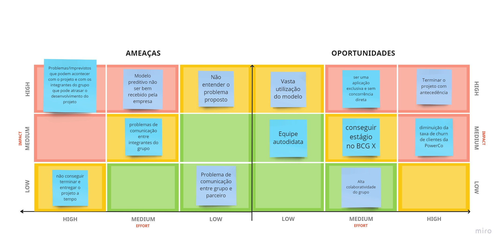
Fonte: Autoria Própria

&emsp;&emsp;Portanto, o processo de planejamento e gestão de qualquer projeto exige uma visão detalhada e antecipada dos riscos inerentes, e a matriz de riscos é uma ferramenta vital para esse fim. A matriz de riscos, além de identificar os riscos, atua como um direcionador essencial para a tomada de decisões e a gestão de recursos financeiros. A implementação dessa matriz, no caso da PowerCo, demonstra uma estratégia para garantir que o projeto seja conduzido considerando possíveis obstáculos e ameaças, visando minimizar impactos negativos e assegurando a continuidade do projeto.

#### 4.1.6. Personas

&emsp;&emsp;A presente seção é focada nas personas, um conceito de extrema importância para o desenvolvimento de um bom produto. 
  As personas se diferenciam do público-alvo por não serem apenas um conjunto de dados demográficos, elas carregam uma 
  série de dados subjetivos e informações quase pessoais que trazem maior clareza do que precisa ser desenvolvido como 
  produto para elas. Em suma, elas atuam como um norte para a equipe que deve sempre pensar em como tornar a experiência
  dessas personas a melhor possível. Para facilitar a elaboração da solução, foram criadas duas personas, uma que possui um conhecimento prévio sobre modelo preditivo e outra que não entende sobre o assunto.

  &emsp;&emsp;No projeto da PowerCo, conforme as figuras 05 e 06, as Personas foram utilizadas para criar representações fictícias de perfis de clientes ideais. Isso ajudou a equipe a compreender melhor as necessidades, comportamentos e motivações dos clientes reais, orientando o desenvolvimento do produto que atendesse de forma mais eficaz e personalizada às demandas do mercado-alvo.

  &emsp;&emsp;De acordo com o Alan Cooper³, "personas são arquétipos hipotéticos de usuários reais, definidos com rigor e precisão significativos". Trata-se de personagens fictícios, construídos a partir da coleta de dados dos usuários em potencial e que servirão para orientar o desenvolvimento do produto ou serviço".


Figura 05 - Persona 01


Fonte: Autoria Própria

Figura 06 - Persona 02


Fonte: Autoria Própria

&emsp;&emsp; Portanto, as personas são essenciais no desenvolvimento de produtos voltados para atender às reais necessidades e expectativas dos usuários porque proporcionam uma compreensão profunda do público-alvo. No projeto da PowerCo, essas representações fictícias de clientes ideais se fizeram cruciais no direcionamento do desenvolvimento de um produto personalizado e eficaz, alinhando-se com a visão de Alan Cooper sobre a importância das personas como guias precisos para o sucesso do produto.

#### 4.1.7. Jornadas do Usuário

&emsp;&emsp;A Jornada do Usuário é um mapa visual de todas as etapas desse relacionamento do cliente com o que as empresas 
oferecem. Ela descreve o passo a passo percorrido, detalhando todos os pontos de contato e interações do ponto de vista do usuário, seus sentimentos e sensações em cada fase.

&emsp;&emsp;Em um artigo da Aela School datado de 22 de abril de 2021, a Jornada do Usuário⁴ "é a ferramenta que faz o mapeamento de todo esse processo de interação do consumidor. Por meio dela, podemos encontrar todos os pontos de contato que o usuário possui com o produto e montar uma história na qual ele é o protagonista".

&emsp;&emsp;No projeto da PowerCo, conforme as figuras 07 e 08, a Jornada do Usuário foi aplicada para mapear a experiência do cliente em todas as interações com o produto, ajudando a identificar pontos de dor e oportunidades de melhoria ao longo da jornada e permitindo um aprimoramento contínuo e uma experiência mais satisfatória para o usuário.


Figura 07 - Mapa Jornada do Usuário 01

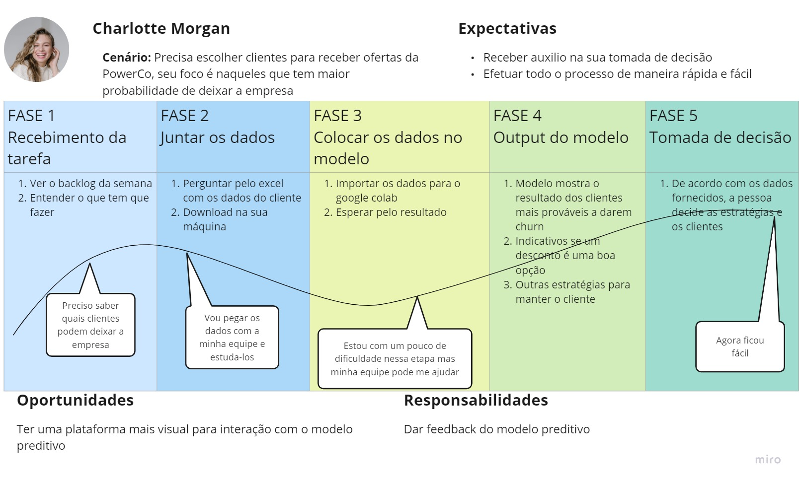
Fonte: Autoria Própria

Figura 08 - Mapa Jornada do Usuário 02

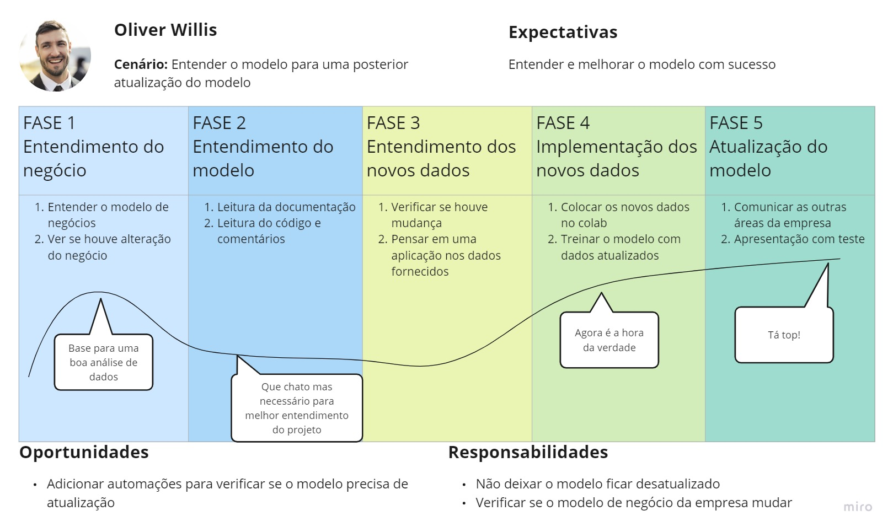
Fonte: Autoria Própria

&emsp;&emsp;Logo, o entendimento e o mapeamento da Jornada do Usuário são essenciais para qualquer negócio que busca uma conexão efetiva com seu pública-alvo. Essa ferramenta destaca cada ponto de contato do cliente com o produto, tendo uma perspectiva centrada no usuário. Para a PowerCo, a aplicação dessa ferramenta permitiu a identificação de áreas que necessitam de atenção e aprimoramento, potencializando a capacidade da empresa de proporcionar uma experiência mais fluida e satisfatória.

#### 4.1.8 Política de Privacidade

&emsp;&emsp;Informações Gerais sobre a Empresa/Organização:
  A BP é uma das maiores empresas de energia do mundo, envolvida em diversos setores relacionados à exploração, produção, 
refino, distribuição e comercialização de petróleo, gás natural e produtos derivados. A empresa British Petroleum 
International Limited, possui sede em Chertsey Road, Sunbury on Thames, Middlesex, TW16 7BP, registrada na Inglaterra e 
no País de Gales com o número de empresa 00542515.

&emsp;&emsp;Informações sobre o tratamento de dados:
  A BP recolhe dados pessoais dos usuários que os fornecem voluntariamente, especialmente quando os mesmos entram em 
contato com a empresa, subscrevem newsletters, webcasts ou utilizam serviços personalizados. Alguns detalhes contextuais 
sobre a educação dos usuários também podem ser coletados para fins de correspondência de trabalho. A empresa 
também coleta dados por meio de cookies e tecnologias semelhantes.

&emsp;&emsp;Quais dados pessoais são coletados (inclusive os dados não informados pelo usuário, como IP, 
localização, etc):
  Os dados pessoais coletados podem incluir detalhes de contato, preferências por serviços de webcast, detalhes 
educacionais para correspondência de trabalho e qualquer informação adicional fornecida voluntariamente pelos usuários. 
Além disso, a empresa coleta dados de cookies e tecnologias semelhantes, como endereços IP, idioma preferencial, 
número de visitantes do site, páginas visitadas, dados de localização e interações com o site.

&emsp;&emsp;Onde os dados são coletados (fonte):
  Os dados são coletados diretamente dos usuários quando eles fornecem informações por meio do site ou interagem 
com o site usando cookies e tecnologias semelhantes.

&emsp;&emsp;Para quais finalidades os dados são utilizados:
  Os dados coletados são usados para várias finalidades, incluindo melhorar o conteúdo e a funcionalidade do site, 
analisar o comportamento e as interações do usuário, personalizar a experiência do usuário, realizar testes de 
conteúdo, enviar comunicações como boletins informativos, avaliar o sucesso da campanha de marketing e adaptar a 
publicidade com base nos interesses do usuário.

&emsp;&emsp;Onde os dados ficam armazenados:
  Os dados pessoais são armazenados de forma segura pela empresa. A BP International Limited é uma empresa internacional 
e os dados podem ser armazenados ou transferidos para outras empresas da BP em todo o mundo. Provedores de serviços 
terceirizados também podem ser usados para hospedar webcasts e oferecer suporte técnico.

&emsp;&emsp;Período de armazenamento de dados (retenção):
  A empresa conserva os dados pessoais durante o tempo necessário para cumprir as finalidades para as quais foram 
recolhidos. Alguns dados, como mensagens de contato, podem ser excluídos ou desidentificados assim que as consultas 
forem atendidas. Listas de supressão contendo detalhes de usuários não inscritos podem ser mantidas para honrar as 
preferências do usuário.

&emsp;&emsp;Uso de Cookies e/ou Tecnologias Similares:
  Cookies e tecnologias semelhantes são usadas para coletar informações sobre as interações do usuário com o site, 
hardware do dispositivo e comportamento de navegação. Essas informações ajudam a melhorar o conteúdo, a funcionalidade 
e a experiência do usuário do site. Alguns cookies são necessários para a funcionalidade básica do site, enquanto outros 
são usados para análise de desempenho, teste de conteúdo, pesquisas, publicidade e rastreamento de campanhas.

&emsp;&emsp;Com quem esses dados são compartilhados (parceiros, fornecedores, subcontratados):
  Os dados pessoais podem ser compartilhados com empresas da BP em todo o mundo, bem como com provedores de serviços 
terceirizados que hospedam webcasts e que oferecem suporte técnico. A empresa também faz parceria com plataformas de mídia 
social e plataformas de publicidade online, que podem usar cookies de terceiros para personalizar anúncios com base nos 
interesses do usuário.

&emsp;&emsp;Informações sobre medidas de segurança adotadas pela empresa:
  A empresa leva a segurança a sério e implementa diversas medidas de precaução, incluindo, por exemplo, criptografia e 
estruturas de conformidade, para proteger informações pessoais. Os provedores terceirizados são obrigados a processar os 
dados conforme as instruções da empresa e as medidas de segurança contratuais.

&emsp;&emsp;Orientações sobre como a empresa/organização atende aos direitos dos usuários:
  A BP respeita a privacidade do usuário e oferece opções para que os usuários exerçam seus direitos. Os usuários têm o 
direito de acessar, retificar ou excluir seus dados pessoais. O consentimento é obtido para o envio de comunicações e os 
usuários podem cancelar essas comunicações a qualquer momento.

&emsp;&emsp;Informações sobre como o titular de dados pode solicitar e exercer os seus direitos:
  Os usuários podem entrar em contato com a empresa usando a funcionalidade 'Fale conosco' no rodapé do site ou por meio do 
link de contato fornecido para questões ou dúvidas relacionadas à privacidade. Na UE, os usuários podem levantar questões de privacidade com a Autoridade de Proteção de Dados relevante.

&emsp;&emsp;Informações de contato do Data Protection Officer (DPO):
  Por meio das informações pesquisadas não foi possível incluir detalhes explícitos sobre o responsável pela proteção de dados 
ou informações de contato do responsável pela proteção de dados. Os usuários são incentivados a usar a funcionalidade 
'Fale conosco' no site ou os links de contato fornecidos para consultas relacionadas à privacidade.

&emsp;&emsp;Em resumo, a Política de Privacidade da BP destaca a responsabilidade com que a empresa aborda a proteção de dados dos usuários. Através das diversas etapas e informações detalhadas, a empresa não apresenta apenas estar conforme os regulamentos legais e éticos, mas também demonstra transparência em relação ao uso e gestão dos dados pessoais, enfatizando a importância do consentimento do usuário. A abordagem da BP reflete um compromisso contínuo em relação à privacidade e à proteção de dados.

### 4.2. Compreensão dos Dados

#### 4.2.1. Exploração de dados


&emsp;&emsp;As estatísticas da tabela de clientes forneceram informações sobre a distribuição dos dados e auxiliam a entender a tendência 
central, a dispersão e os valores extremos em cada variável. Com base nessas estatísticas, retiram-se várias conclusões sobre 
seus dados, como a presença de outliers, a faixa de valores típicos, relação entre diferentes variáveis, também serve de 
orientação para definir ações estratégicas e revelar insights importantes. Ademais foi observado que os valores negativados 
(na linha 'min') são erros de input que serão analisados e tratados futuramente pela equipe. Observa-se as estatísticas na tabela 01:

Tabela 01 - Tabela estatística clientes
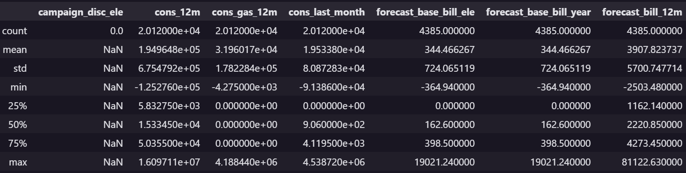
Fonte: Autoria Própria

&emsp;&emsp;A tabela estatística de histórico de churn sugere que a maioria das amostras tem um valor de churn igual a 0 (sem cancelamento), 
já que tanto o primeiro quanto o terceiro quartil (conceito estatístico utilizado para dividir um conjunto de dados ordenados em 
quatro partes iguais) são 0. No entanto, a média de 0.099 sugere que cerca de 9.9% das amostras têm um valor de churn igual a 1 
(houve cancelamento). Observa-se o histórico de churn presente na tabela 02:

Tabela 02 - Histórico de churn

Fonte: Autoria Própria

&emsp;&emsp;Essas estatísticas sobre o histórico de preços fornecem uma visão geral sobre a distribuição e os intervalos de valores para 
cada variável. Esses valores são úteis para entender a variação e a tendência central dos preços associados a diferentes 
componentes, também, para identificar possíveis valores extremos ou anomalias nos dados. Observa-se o histórico de presos contidos na tabela 03:

Tabela 03 - Histórico de preços
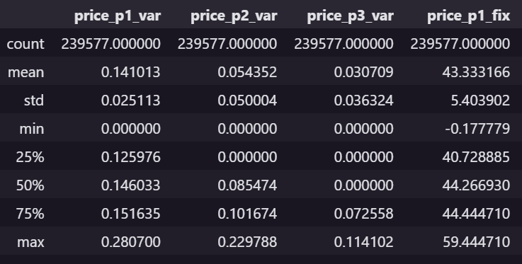
Fonte: Autoria Própria

&emsp;&emsp;Abaixo temos o quadro 01, quadro 02 e quadro 03 que atribuiem a classificação das colunas em categórias ou numéricas. A estratégia usada foi através do método de info() do pandas descobrir o tipo da coluna, ou seja, se as colunas são int, float ou object. Sabendo essa informação construiu-se uma tabela transpondo colunas do tipo inteiro e ponto flutuante para colunas numéricas, e colunas 
do tipo objeto para categáricas.


Quadro 01 - Categorias da base de clientes
|    | Column                  | Non-Null Count | Dtype       |
|---:|:------------------------|:--------------:|:------------|
|  0 | id                      | 20120          | categórico  |
|  1 | activity_new            | 8221           | categórico  |
|  2 | campaign_disc_ele       | 0              | numérico    |
|  3 | channel_sales           | 14846          | categórico  |
|  4 | cons_12m                | 20120          | numérico    |
|  5 | cons_gas_12m            | 20120          | numérico    |
|  6 | cons_last_month         | 20120          | numérico    |
|  7 | date_activ              | 20120          | categórico  |
|  8 | date_end                | 20118          | categórico  |
|  9 | date_first_activ        | 4385           | categórico  |
| 10 | date_modif_prod         | 19918          | categórico  |
| 11 | date_renewal            | 20076          | categórico  |
| 12 | forecast_base_bill_ele  | 4385           | numérico    |
| 13 | forecast_base_bill_year | 4385           | numérico    |
| 14 | forecast_bill_12m       | 4385           | numérico    |
| 15 | forecast_cons           | 4385           | numérico    |
| 16 | forecast_cons_12m       | 20120          | numérico    |
| 17 | forecast_cons_year      | 20120          | numérico    |
| 18 | forecast_discount_energy| 19970          | numérico    |
| 19 | forecast_meter_rent_12m | 20120          | numérico    |
| 20 | forecast_price_energy_p1| 19970          | numérico    |
| 21 | forecast_price_energy_p2| 19970          | numérico    |
| 22 | forecast_price_pow_p1   | 19970          | numérico    |
| 23 | has_gas                 | 20120          | categórico  |
| 24 | imp_cons                | 20120          | numérico    |
| 25 | margin_gross_pow_ele    | 20105          | numérico    |
| 26 | margin_net_pow_ele      | 20105          | numérico    |
| 27 | nb_prod_act             | 20120          | numérico    |
| 28 | net_margin              | 20102          | numérico    |
| 29 | num_years_antig         | 20120          | numérico    |
| 30 | origin_up               | 20006          | categórico  |
| 31 | pow_max                 | 20116          | numérico    |

Fonte: Autoria Própria

Quadro 02 - Categorias da tabela de churn
|    | Column | Non-Null Count | Dtype   |
|---:|:-------|:--------------:|:-------:|
|  0 | id     | 16096          | categórico  |
|  1 | churn  | 16096          | numérico   |


Fonte: Autoria Própria

Quadro 03 - Categorias da base de histórico de preços
|    | Column      | Non-Null Count | Dtype    |
|---:|:------------|:--------------:|:--------:|
|  0 | id          | 241238         | categórico   |
|  1 | price_date  | 241238         | categórico   |
|  2 | price_p1_var| 239577         | numérico  |
|  3 | price_p2_var| 239577         | numérico  |
|  4 | price_p3_var| 239577         | numérico  |
|  5 | price_p1_fix| 239577         | numérico  |
|  6 | price_p2_fix| 239577         | numérico  |
|  7 | price_p3_fix| 239577         | numérico  |
Fonte: Autoria Própria

**Gráficos de relacionamento**


&emsp;&emsp;A relação entre o preço atual do consumo de energia (imp_cons) e a previsão de consumo elétrico para o próximo mês 
(forecast_cons) - apresentado na figura 09 - é forte e relevante porque os valores são muito parecidos. Conclui-se então que ao interpretar essa tabela 
que uma coluna pode se tornar irrelevante ao entender que os valores são iguais e que há existência de outliers.

Figura 09 - Relação entre preço atual de consumo de energia e previsão de consumo elétrico para o próximo mês
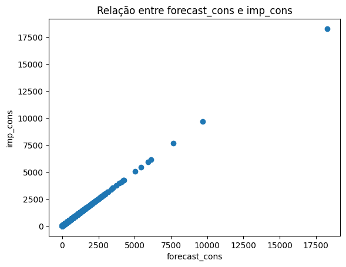
Fonte: Autoria Própria


&emsp;&emsp;A relação entre o preço atual do consumo de energia (imp_cons) e a previsão da fatura de consumo elétrico para os próximos 
12 meses (forecast_bill_12m), presente na figura 10, é relevante porque os valores se concentram numa parte, podem ser descritos numa regressão linear 
e com presença de outliers.

Figura 10 - Relação entre a previsão da conta de energia e preço atual do consumo de energia
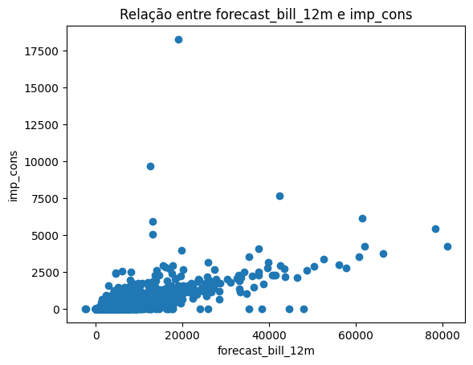
Fonte: Autoria Própria


&emsp;&emsp;A relação entre o valor base da fatura de eletricidade prevista para o próximo mês (forecast_base_bill_ele) e o valor base da 
fatura de eletricidade prevista para o ano (forecast_base_bill_year) é forte e relevante porque os valores são muito parecidos 
e no final poderemos escolher um deles porque se escolhermos os dois poderemos enviesar o modelo. Segue a relação abaixo na figura 11.

Figura 11 - Relação entre previsão da fatura de eletricidade de base para o mês seguinte e previsão da fatura de eletricidade de base para o ano civil
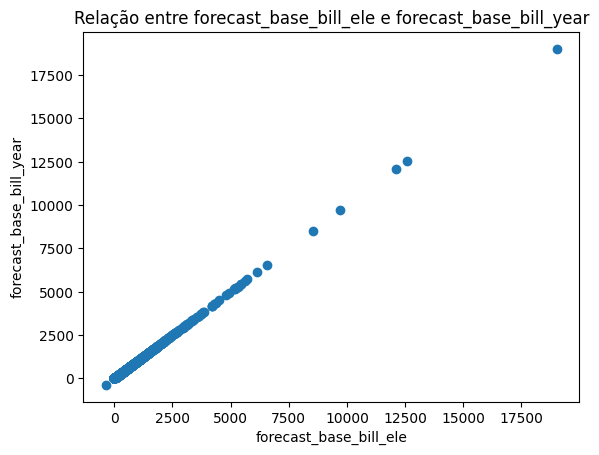
Fonte: Autoria Própria


#### 4.2.2. Pré-processamento dos dados


&emsp;&emsp;O grupo identificou que as colunas de "campaign_disc_ele" e "date_firts_activ" estão com muitos dados faltantes, portanto 
estamos deletando essas colunas para que elas não atrapalhem o modelo.


&emsp;&emsp;O modelo não entende "t" e "f", por conta disso, estamos mudando para True e False. Depois disso é necessário mudar o tipo do 
dado da coluna para int (inteiro), para que o modelo entenda que a informação é binária.


&emsp;&emsp;O código abaixo faz uma limpeza no dataframe. Não houve nenhuma linha ou coluna excluída, mas podemos ver que reduziu espaço 
de memória. Fizemos isso para conseguirmos trabalhar melhor com o dataframe.


&emsp;&emsp;Na primeira parte, está sendo inserido o valor "unknown" nos campos com valores nulos da coluna de channe_sales, amostrados na figura 12. A mesma ação está sendo tomada com a coluna origin_up. Na última parte, estamos substituindo os campos nulos na coluna de activity_new por 0 e os campos com valores para 1. 
A razão para substituir valores nulos por "unknow" é que consideramos a falta de dados nas colunas como correta, ou seja, não temos dados do canal de vendas porque não houve um canal. 
Já no caso da substituição de valores na coluna de activity_new está relacionada a uma correlação observada, onde sempre que há dados os valores são altos e quando não há são baixos. A hipótese adotada é a de que a presença de dados significa que o cliente é uma empresa, e quando não há seria uma residência ou algo do tipo.

Figura 12 - Tratamento de valores nulos em colunas importantes
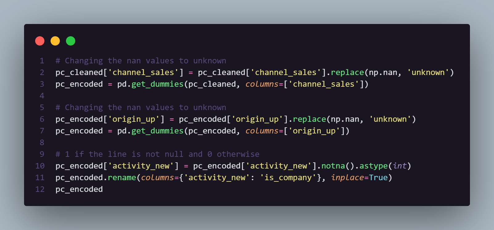
Fonte: Autoria Própria


&emsp;&emsp;Foi identificado pouca relevância das colunas de "forecast_base_bil_year", "forecast_bill_12m", "forecast_cons" porque existem 
muitos poucos dados e a sua correlação com outras colunas é tão alta que poderia ser considerado valores duplicados e que 
podem inviesar o modelo. Por isso as colunas foram excluídas.


&emsp;&emsp;Existem datas inválidas no banco de dados. Ex: 29/02/2018, OBS: 2018 não é ano bissexto. O código itera sobre as features 
especificadas e quando encontra uma data inválida a substitui por outra data correspondente, como mostra a figura 13. Depois cria-se uma coluna de ano ao invés da data completa, foi entendido que dia a mês não são tão relevantes e que essa informação seria melhor aproveitada dessa maneira.

Figura 13 - Código para substituição de valores inválidos
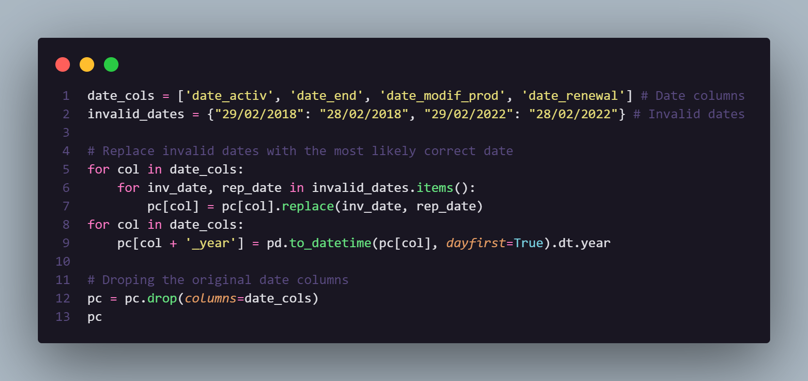
Fonte: Autoria Própria


&emsp;&emsp;Com uma exploração dos dados e uma análise identificamos variavéis que se relacionam bastante e que não agregam ao modelo.


&emsp;&emsp;Verificamos que existem valores negativos em algumas colunas, então excluimos esses valores negativos porque entendemos que 
eles não podem ser usados pois podem inviesar o modelo.

&emsp;&emsp;Foi encontrado valores negativos nas colunas de margem líquida (margin_net_pow_ele) e margem bruta (margin_gross_pow_ele). 
Esses valores precisam ser ajustados. Entendemos que como essa margem não pode ser negativa deve ter sido um erro de 
digitação (erro de input), por isso resolvemos substituir os valores negativos pelos valores absolutos. Foi escolhida esta 
abordagem ao invés da substituição por valores estatísticos porque acreditamos que dessa maneira a distribuição real dos 
dados será preservada.
Foi identificado valores negativos nas colunas de consumo dos últimos 12 meses (cons_12m). Por isso, foi escolhido substituir 
os valores errados pela média da coluna.


#### 4.2.3. Hipóteses

&emsp;&emsp;Depois de explorar e pré-processar os dados, foi observado as seguintes hipóteses para a causa problema:

  &emsp;&emsp;1° Hipótese: 
  A coluna forcast_discount_energy possui grande influência na causa ou na solução do problema pois descontos são importantes 
  para a retenção e permanência do cliente, e a maioria dos números dessa coluna é 0.

  &emsp;&emsp;2° Hipótese:
  É explícito que a comunicação entre cliente e empresa é um dos principais pilares para que o consumidor continue com a empresa, 
  por isso a coluna de channel_sales excerce grande impacto no churn.

  &emsp;&emsp;3° Hipótese:
  No entanto, a coluna price_date se torna irrelevante para o modelo pois possui valores repetidos para todos os id's


### 4.3. Preparação dos Dados e Modelagem

&emsp;&emsp;A preparação de dados é o alicerce de qualquer análise profunda e modelo preditivo. A robustez e confiabilidade dos dados influenciam diretamente a capacidade do modelo de gerar resultados válidos. É uma fase que exige meticulosidade e dedicação, o que explica o motivo pelo qual os cientistas de dados investem um tempo significativo nela.
No entanto, uma vez que essa fundação está estabelecida, o foco muda para a modelagem. Aqui, os dados são mais do que simples números ou fatos; eles se transformam em informação com potencial para revelar padrões, tendências e insights. Durante esta fase, algoritmos são escolhidos, treinados e avaliados com o objetivo de desenvolver um modelo que, quando apresentado a novos dados, possa prever ou classificar com precisão. 

&emsp;&emsp;Entretanto, antes de aprofundar nas complexidades técnicas, há um pré-requisito essencial: Compreender claramente qual é o problema a ser resolvido e qual é o objetivo da modelagem. Não se trata apenas de manipular dados e aplicar algoritmos, mas de entender o contexto mais amplo. Qual é a pergunta central que está sendo responder? Quais são os objetivos de negócios subjacentes? Como definir sucesso ou falha? As respostas a essas perguntas guiam a escolha das métricas de avaliação - são elas que dirão se o modelo está se aproximando do objetivo ou se afastando dele. Além disso, é vital reconhecer as limitações intrínsecas do problema, sejam elas decorrentes de restrições de dados, desafios técnicos ou barreiras organizacionais.
Portanto, o processo não é apenas técnico, mas também estratégico. A sinergia entre a preparação adequada dos dados, uma compreensão clara dos objetivos e uma modelagem eficaz é o que leva a soluções de ciência de dados verdadeiramente impactantes.

&emsp;&emsp;Considerando os conceitos apresentados anteriormente, a pergunta que estamos buscando responder é a seguinte: quais clientes são mais propensos a cancelar o contrato com a PowerCo? Nossos objetivos subjacentes incluem identificar esses clientes e tomar as medidas necessárias, como oferecer descontos ou implementar estratégias de marketing. Definimos nosso sucesso como a redução da taxa de cancelamento da empresa. Dado o desequilíbrio nos dados, ou seja, há muito mais informações sobre clientes que permaneceram na empresa do que sobre aqueles que cancelaram, optamos por usar a métrica AUC ROC para avaliar o desempenho de nosso modelo de classificação. Essa métrica indica o quão eficaz um modelo preditivo é na diferenciação entre dois resultados (0 e 1).

a) Para compreender profundamente a relevância das features na predição, utilizamos duas abordagens distintas: a Importância do 
Modelo do Random Forest e a Shap Importance, oriunda da biblioteca SHAP. A combinação dessas ferramentas torna-se crucial pois 
elas avaliam a importância das features sob perspectivas diferentes, ampliando nossa capacidade de entender o impacto de cada variável no modelo. 
As ferramentas operam da seguinte maneira:
RF - A Importância do Random Forest quantifica a redução média da impureza ocasionada por uma feature em todas as árvores da floresta. Em termos simplificados, esta métrica reflete o quanto cada variável contribui para a diminuição da impureza ponderada em uma árvore. No entanto, é importante ressaltar que esta metodologia pode ser tendenciosa, favorecendo features com maior número de categorias e não considerando possíveis interações entre elas.
SHAP - Os valores SHAP são baseados na teoria dos jogos cooperativos, e designam a cada feature um valor que representa sua importância para uma determinada predição. O valor SHAP de uma feature indica a variação média na predição do modelo ao incluir ou excluir essa variável, ponderando por todas suas possíveis combinações. Este método é notável por levar em consideração as interações entre as variáveis e oferecer uma interpretação abrangente do modelo, seja ela global ou local.

Abaixo, apresenta-se as features e sua média da 
importância das duas ferramentas:
```
total_fix: 0.038253999999999996
forecast_price_energy_p2: 0.0366755
net_margin: 0.0289245
forecast_discount_energy: 0.028435000000000002
forecast_price_pow_p1: 0.0270795
margin_net_pow_ele: 0.026918
forecast_base_bill_ele: 0.026881000000000002
margin_gross_pow_ele: 0.025885
cons_12m_log: 0.0253785
origin_up_kamkkxfxxuwbdslkwifmmcsiusiuosws: 0.025226000000000002
num_years_antig: 0.025216
cons_12m_corrected: 0.0247685
forecast_price_energy_p1: 0.023980500000000002
date_end_year: 0.022470499999999997
forecast_meter_rent_12m: 0.0224035
total_var: 0.022287
p3_var: 0.022223
date_activ_year: 0.021983
imp_cons: 0.021914000000000003
pow_max: 0.020445500000000002
origin_up_ldkssxwpmemidmecebumciepifcamkci: 0.020231
kwh_consumed: 0.0197595
cons_last_month: 0.019595
forecast_cons_12m: 0.019303
p2_fix: 0.01896
origin_up_lxidpiddsbxsbosboudacockeimpuepw: 0.0182
p1_fix: 0.018022
p2_var: 0.017031
p3_fix: 0.0137305
cons_gas_12m: 0.012239
date_modif_prod_year: 0.012024
origin_up_ewxeelcelemmiwuafmddpobolfuxioce: 0.0105835
forecast_cons_year: 0.0102765
channel_sales_usilxuppasemubllopkaafesmlibmsdf: 0.009329
origin_up_usapbepcfoloekilkwsdiboslwaxobdp: 0.0076355
channel_sales_foosdfpfkusacimwkcsosbicdxkicaua: 0.0070775000000000005
is_company: 0.006901
date_renewal_year: 0.0052505
channel_sales_lmkebamcaaclubfxadlmueccxoimlema: 0.0051245
origin_up_aabpopmuoobccoxasfsksebxoxffdcxs: 0.0044735
channel_sales_fixdbufsefwooaasfcxdxadsiekoceaa: 0.0043425
nb_prod_act: 0.003142
channel_sales_ewpakwlliwisiwduibdlfmalxowmwpci: 0.002418
has_gas: 0.0022535000000000003
p1_var: 0.0008985
channel_sales_epumfxlbckeskwekxbiuasklxalciiuu: 0.000858
channel_sales_sddiedcslfslkckwlfkdpoeeailfpeds: 1.45e-05
```

&emsp;&emsp;Após essa análise, torna-se evidente a possibilidade de descartar algumas features cujos valores de importância são significativamente mais baixos, como:
p1_var: 0.0008985
channel_sales_epumfxlbckeskwekxbiuasklxalciiuu: 0.000858
channel_sales_sddiedcslfslkckwlfkdpoeeailfpeds: 1.45e-05

b) Escolher as métricas adequadas é crucial, já que a seleção correta das métricas pode determinar o sucesso ou fracasso de um projeto. Elas garantem que a atenção esteja voltada para as atividades e resultados mais relevantes, oferecem informações concretas para decisões, diminuindo subjetividade, facilitam o acompanhamento do progresso e fornecem feedbacks regulares, apontam áreas que precisam de otimização nos processos e resultados, estabelecem objetivos claros, motivando e direcionando todos para a mesma meta, auxiliam na avaliação correta do desempenho de indivíduos e equipes, ajudam a direcionar recursos (como tempo e dinheiro) para atividades de maior retorno e através do monitoramento, é possível identificar e resolver problemas antes que se agravem.
Além disso, resultados sustentados por métricas sólidas aumentam a confiança em um projeto ou organização.
Então, a seleção de métricas corretas é essencial para o sucesso de um projeto, guiando decisões, otimizações e aumentando a confiança nos resultados apresentados.
A escolha das métricas adequadas torna-se crucial, uma vez que a seleção correta das mesmas é capaz de determinar o êxito ou insucesso de um projeto. Tais métricas asseguram que a atenção recaia sobre as atividades e resultados mais pertinentes, provendo informações concretas para decisões, reduzindo subjetividade, simplificando o monitoramento do progresso e proporcionando feedbacks regulares. 
Elas identificam áreas necessitadas de otimização nos processos e desfechos, estabelecem alvos claros, promovendo motivação e alinhando todos em direção a um objetivo comum. Além disso, auxiliam na avaliação precisa do desempenho de indivíduos e equipes, direcionando recursos, como tempo e finanças, para atividades de maior retorno. Mediante o monitoramento, é viável detectar e resolver problemas antes que se intensifiquem.
Adicionalmente, resultados embasados em métricas sólidas amplificam a confiança depositada em um projeto ou organização. 
Portanto, a seleção apropriada de métricas emerge como elemento essencial para o sucesso de um projeto, orientando escolhas, 
otimizações e incrementando a confiabilidade nos resultados expostos.
Após o reconhecimento da relevância das métricas na avaliação de um modelo, opta-se por utilizar o F1-Score, como é apresentado na tabela 04, a ROC-AUC (Área sob a curva ROC) e a Precisão como indicadores principais. Essas três métricas demonstraram ser cruciais para validar o modelo. Contudo, 
optou-se por não priorizar a acurácia, uma métrica frequentemente adotada, devido às suas limitações em contextos de classes desequilibradas. 
Em situações como previsões de churn, a acurácia pode ser enganadora. Por exemplo, se apenas 5% dos clientes realizarem churn, um modelo que preveja que nenhum cliente efetuará churn ainda teria uma acurácia de 95%.

Tabela 04 - Resultados dos modelos

|    | Modelo           |    Acurácia    |  Precisão    |  F1        | AUC ROC    |
|---:|:-----------------|:--------------:|:------------:|:----------:|:----------:|
|  0 | Ensemble         | 87%            | 78%          | 14%        | 53%        |
|  1 | CatBoost         | 87%            | 33%          | 1%         | 50%        |
|  2 | XGBoost          | 85.71%         | 66.41%       | 61.40%     | 60%        |
|  3 | Random Forest    | 87%            | 73%          | 15%        | 54%        |
Fonte: Autoria Própria


&emsp;&emsp;Conforme mencionado anteriormente, três métricas-chave foram selecionadas para avaliar o desempenho do modelo. Primeiramente, 
destaca-se o F1 Score, que representa a média harmônica entre a precisão e a revocação. Esta métrica revela-se extremamente relevante, 
sobretudo ao tratar de previsões de churn. Isso deve-se à sua habilidade em equilibrar a precisão e a revocação, considerando 
o desequilíbrio característico presente em conjuntos de dados de churn. A precisão configura-se como outra métrica essencial na avaliação de modelos de classificação. Ela assume destaque especialmente quando os custos de falsos positivos são consideráveis. Em contextos de churn, um falso positivo pode acarretar consequências significativas. Assim, garantir uma alta precisão pode ser mais pertinente do que apenas buscar uma acurácia global elevada.
Por fim, mas de suma importância, destaca-se o ROC-AUC. Essa métrica assume um papel fundamental na avaliação da habilidade 
discriminatória de um modelo de classificação, principalmente em situações de classes desbalanceadas. 
O ROC-AUC avalia a capacidade do modelo de distinguir entre a classe positiva (churn) e a classe negativa (não churn), 
sem ser influenciado pelo desequilíbrio das classes. Adicionalmente, provê insights valiosos sobre a eficácia do modelo, 
contribuindo para tomadas de decisão estratégicas voltadas à retenção de clientes.

c) Conclui-se então que conclusão de um modelo ideal para nosso projeto foi o Ensemble que é uma técnica que combina múltiplos
 modelos com o objetivo de produzir uma previsão mais precisa e robusta do que seria possível ao se utilizar um único modelo. 
 Assim como as árvores de decisão são os fundamentos do Random Forest, diferentes algoritmos de aprendizado de máquina podem integrar um modelo Ensemble.
A premissa central do Ensemble é que diferentes modelos têm seus próprios pontos fortes. Ao uní-los, é possível colher os benefícios
singulares de cada um. Tal abordagem pode ser equiparada a um conjunto de especialistas: cada membro contribui com sua especialidade única, culminando em uma decisão coletivamente mais informada.
No Projeto atual, a combinação abordada engloba os modelos Random Forest e XGBoost. Tal combinação se mostra benéfica por uma série de motivos. Ambos são algoritmos de aprendizado de máquina, mas operam de modos distintos. O Random Forest é fundamentado em árvores de decisão, enquanto o XGBoost se classifica como um algoritmo de gradient boosting. Ao integrá-los, há uma diversificação da abordagem de aprendizado de máquina, o que pode amplificar o desempenho global.
Adicionalmente, modelos enquadrados no Ensemble tendem a apresentar maior resistência contra overfitting. Quando um modelo singular, como o XGBoost, mostra tendência ao superajuste dos dados, o Random Forest pode atuar como contraponto, oferecendo uma análise mais balanceada. Frequentemente, a performance média de um ensemble de modelos excede a de modelos individuais. Isso acontece porque diferentes modelos podem identificar padrões variados nos dados. 
Ao amalgamar suas previsões, obtém-se uma projeção mais acurada e estável. Como nota final, ao reunir previsões oriundas de distintos modelos, reforça-se a confiança nas estimativas geradas. 
A harmonia entre os modelos pode sinalizar uma probabilidade elevada de a previsão ser precisa. 

Os resultados foram: 
Acurácia: 87%
Precisão: 78%          
F1-Score: 14%        
AUC ROC: 53%
                          
&emsp;&emsp;Acredita-se que, mesmo não tendo resultados muito altos, é o modelo ideal para o projeto.        


### 4.4. Comparação de Modelos

&emsp;&emsp;Para determinar o desempenho de um modelo, é essencial contar com uma métrica de avaliação. É por meio dela que se pode compreender o quão bem um modelo está performando e identificar oportunidades de aprimoramento. 

&emsp;&emsp;Uma métrica amplamente reconhecida em problemas de classificação é a AUC-ROC. Como descrito por Vinícius Rodrigues: "A curva ROC avalia a habilidade do modelo em diferenciar entre duas categorias - frequentemente denotadas como 1 e 0 ou positivo e negativo. Modelos ideais são capazes de distinguir com alta precisão entre essas categorias. A AUC varia de 0 a 1, com um limiar de classe definido em 0,5. Valores acima desse limiar são classificados em uma categoria, enquanto valores abaixo são classificados na outra. Um modelo cujas previsões são inteiramente imprecisas tem uma AUC de 0, ao passo que um modelo perfeito apresenta uma AUC de 1. A métrica AUC serve como um indicador confiável na seleção do modelo mais adequado"(Acessado em 19/09/2023: https://medium.com/bio-data-blog/entenda-o-que-é-auc-e-roc-nos-modelos-de-machine-learning-8191fb4df772).

&emsp;&emsp;No contexto de churn, procura-se prever quais clientes podem abandonar um serviço ou produto. Nesse cenário, utiliza-se a métrica AUC-ROC como referência principal. Ela evidencia a capacidade do modelo em discernir entre clientes que provavelmente sairão e aqueles que ficarão, garantindo confiança e qualidade na sua aplicação.

&emsp;&emsp;"Os hiperparâmetros são parâmetros cujos valores não são aprendidos a partir dos dados, mas são configurados antes do treinamento e controlam aspectos do processo de treinamento" (GOODFELLOW; BENGIO; COURVILLE, 2016). A partir desta definição pode-se destacar a importância dos hiperparâmetros no processo de modelagem. Eles são responsáveis por definir como o modelo irá interpretar os dados. Também previnem o modelo de aprender apenas com os dados mostrados, evitando cenários de overfitting e underfitting, e são essenciais para a generalização adequada do modelo.

Existem outras métricas também relevantes:

&emsp;&emsp;Acurácia: Calcula a fração de previsões corretas. Embora simples de entender, pode ser enganadora em datasets desbalanceados, pois prever sempre a classe predominante pode resultar em alta acurácia.

&emsp;&emsp;Precisão: Indica a porcentagem de previsões positivas que são verdadeiramente corretas. Torna-se relevante quando o custo de um falso positivo é elevado.

&emsp;&emsp;Recall (Sensibilidade): Mostra a fração de positivos reais identificados corretamente. É crucial quando o custo de um falso negativo é alto.

&emsp;&emsp;F1-Score: Representa a média harmônica entre precisão e recall, buscando um equilíbrio entre eles. Mostra-se especialmente útil quando as classes apresentam grande desequilíbrio.

&emsp;&emsp;Ao longo do projeto, observou-se que o Ensemble não apresentou o desempenho esperado e não produziu resultados satisfatórios. Assim, tornou-se crucial optar por outros modelos a fim de alcançar uma qualidade excepcional. Portanto, foram selecionados três modelos candidatos: XGBoost, Random Forest e SVM.


&emsp;&emsp; O XGBoost é um algoritmo de aprendizado de máquina. Ele se baseia em um conjunto de algoritmos de boosting, incluindo Gradient Boosting, Regularização e Funções de Objetivo Personalizáveis. No contexto de previsão de churn, os hiperparâmetros chave incluem a taxa de aprendizado, a profundidade máxima das árvores e o número de estimadores. A taxa de aprendizado controla a taxa de ajuste do modelo, enquanto a profundidade máxima das árvores afeta a complexidade do modelo e o número de estimadores controla o número de árvores no ensemble. As métricas comuns usadas incluem a AUC-ROC, a AUC-PR, a precisão, a sensibilidade e a especificidade. O XGBoost destaca-se na previsão de churn devido à sua capacidade de enfrentar desafios comuns. Ele lida com maestria com dados desequilibrados, acomoda diversos tipos de dados, incluindo dados ausentes, oferece opções de regularização (L1 e L2) para evitar overfitting e permite uma ampla tunagem de hiperparâmetros.  

&emsp;&emsp;Para otimizar os hiperparâmetros do XGBoost, empregamos uma estrutura de software chamada "OPTUNA". Essa estrutura de otimização de hiperparâmetros é altamente sofisticada, utilizando um algoritmo de otimização bayesiana, que demonstrou ser mais eficaz em comparação com métodos de pesquisa em grade e aleatória (KELDENICH, Tom. "Optuna: Get the Best out of your Hyperparameters - Easy Tutorial." Disponível em: https://inside-machinelearning.com/en/optuna-tutorial/. Acesso em: 21 de setembro de 2023).   
&emsp;&emsp;A utilização dessa ferramenta possibilitou a realização de um número maior de testes, culminando em um desempenho superior em relação às métricas previamente escolhidas.

&emsp;&emsp; Para avaliar esse modelo, utilizamos as métricas AUC-ROC, acurácia, precisão, recall e F1-score, com os seguintes resultados:  

Accuracy: 90.27%  
Precision: 79.57%  
Recall: 51.82%  
F1-score: 51.06%  
AUC-ROC: 71.28%  

&emsp;&emsp; O Random Forest é um algoritmo de aprendizado de máquina que demonstra sua versatilidade e eficácia em várias aplicações, incluindo a nossa busca por soluções no contexto de previsão de churn para a PowerCo. Este modelo se destaca por sua capacidade de combinar a saída de várias árvores de decisão, chegando a um resultado final robusto e confiável.

&emsp;&emsp; Em nosso projeto, o Random Forest se revelou uma ferramenta valiosa na identificação de clientes propensos ao churn. Este algoritmo é composto por várias árvores de decisão, onde cada árvore age como um "especialista" independente na tarefa de prever se um cliente deixará ou permanecerá na PowerCo. Cada árvore, ao analisar as características do conjunto de dados, contribui com sua própria previsão. A previsão final do Random Forest é obtida por meio de um processo de votação, onde as previsões individuais de todas as árvores são consideradas.

&emsp;&emsp; Uma das vantagens notáveis do Random Forest é sua habilidade de evitar overfitting, ou seja, a adaptação excessiva aos dados de treinamento que pode prejudicar a generalização do modelo. Em cenários com conjuntos de dados desequilibrados, como é frequentemente o caso ao lidar com churn, o Random Forest mantém um desempenho consistente. Isso significa que ele pode eficazmente lidar com situações em que há muito mais informações sobre clientes que permanecem do que sobre aqueles que cancelam seus contratos.

&emsp;&emsp; Além disso, o Random Forest demonstrou sua aptidão para trabalhar com uma variedade de tipos de características, sejam elas numéricas ou categóricas. Isso economiza tempo em etapas de pré-processamento, permitindo que o modelo se concentre na tarefa de identificar clientes em risco. Este algoritmo também fornece automaticamente uma medida da importância de cada característica, o que é crucial para entender quais fatores influenciam mais na tomada de decisão do cliente.

&emsp;&emsp;As estratégias mais comuns para a otimização de hiperparâmetros são o Grid Search e o Randomized Search. Inicialmente, são definidos os valores possíveis para os parâmetros a serem testados. O Grid Search avalia todas as combinações possíveis dos parâmetros definidos, enquanto o Randomized Search seleciona combinações aleatórias, ainda seguindo os parâmetros definidos. Em seguida, o modelo com o melhor desempenho é determinado e seus parâmetros são utilizados.

&emsp;&emsp;No nosso caso, optamos por uma estratégia que envolveu primeiro a utilização de uma pesquisa aleatória para identificar o melhor intervalo de hiperparâmetros. Posteriormente, esse intervalo otimizado foi aplicado ao Grid Search. Essa escolha foi baseada na consideração do menor custo computacional e na busca pela melhor otimização do modelo.

&emsp;&emsp; Para avaliar esse modelo, utilizamos as métricas AUC-ROC, acurácia, precisão, recall e F1-score, com os seguintes resultados:  
Acurácia: 91%
Precisão: 80%
Recall: 54%
F1-Score: 52%
AUC ROC: 66%

&emsp;&emsp; A Máquina de Vetores de Suporte (SVM) é um algoritmo de aprendizado supervisionado usado principalmente para classificação. Ele busca um hiperplano que separa as classes de dados maximizando a margem entre elas. Com o auxílio de funções kernel, como a RBF, o SVM pode transformar dados complexos em espaços onde são linearmente separáveis. No contexto de churn, que representa a taxa de clientes que deixam um serviço, o SVM é valioso. Ele permite classificar clientes entre propensos a abandonar ou continuar um serviço. Usando dados históricos, o SVM identifica padrões de comportamento, ajudando empresas a prever e reduzir o churn, otimizando assim suas estratégias de retenção. Uma das técnicas distintas do SVM é o "truque do kernel", que permite transformar dados que inicialmente não são linearmente separáveis em um espaço onde podem ser separados linearmente. Existem diversas funções kernel, como linear, polinomial, RBF (Radial Basis Function) e sigmoidal, que auxiliam nessa transformação. Em suma, o SVM não apenas se destaca como uma ferramenta robusta de classificação, mas também tem aplicações práticas significativas, como na previsão de churn, onde a identificação precisa de clientes em risco pode influenciar diretamente na saúde financeira e na estratégia de retenção de uma empresa.

&emsp;&emsp;A otimização dos hiperparâmetros foi realizada através da combinação de Randomized Search e Grid Search. O Randomized Search foi empregado inicialmente para reduzir as possibilidades e encontrar o melhor intervalo, o qual foi posteriormente utilizado pelo Grid Search. Essa abordagem foi escolhida devido ao alto custo computacional associado ao Grid Search. Utilizando o Randomized Search como etapa preliminar, conseguimos reduzir significativamente esse custo sem comprometer a qualidade do modelo.

&emsp;&emsp; Para avaliar esse modelo, utilizamos as métricas AUC-ROC, acurácia, precisão, recall e F1-score, com os seguintes resultados:  
Acurácia:54%
Precisão: 53%
Recall: 58%
F1-Score: 55%
AUC ROC: 63%

&emsp;&emsp;&emsp;&emsp;Portanto, foi escolhido o modelo XGBoost como modelo final, por conta das suas melhores performeces nas métricas de avaliação, levando em consideração, principalmente, o AUC-ROC (secção 4.3).

### 4.5. Avaliação
&emsp;&emsp;A indústria europeia de energia tem enfrentado mudanças profundas nas últimas décadas, com uma transição clara para fontes de energia mais limpas e renováveis, combinada com a digitalização da infraestrutura. Este cenário tem influenciado significativamente o modelo de negócios, com foco em geração distribuída, armazenamento de energia e serviços de gerenciamento de energia. Os modelos preditivos, por sua vez, estão emergindo como uma ferramenta vital para responder a estas mudanças, ajudando na previsão de demanda, otimização de portfólio e integração de dados.

&emsp;&emsp;No contexto da PowerCo, foi identificado através da matriz SWOT a necessidade de compreender e reagir ao comportamento de "churn" (cancelamento) dos clientes. O conjunto de dados fornecido pela empresa contém ricas informações sobre os clientes, padrões de consumo e interações com a empresa.

&emsp;&emsp;Com base nas informações e análises realizadas, a solução escolhida foi o desenvolvimento de um modelo preditivo utilizando o algoritmo XGBoost. Este modelo tem como objetivo identificar os clientes com maior risco de cancelar os serviços e entender as razões subjacentes a este comportamento.

&emsp;&emsp;O XGBoost é conhecido por sua eficiência e capacidade de lidar com grandes conjuntos de dados, além de ser flexível, permitindo otimizações e ajustes. Além disso, ele se mostrou superior em métricas de avaliação, como AUC-ROC, que mede a capacidade do modelo em distinguir entre classes positivas e negativas. Levando em consideração o cenário de negócios da PowerCo e a necessidade de prever com precisão os clientes propensos ao churn, o XGBoost se apresentou como a melhor escolha.

&emsp;&emsp;O modelo preditivo se alinha diretamente com as tendências de entendimento dos negocios, Além de prever o churn, ele fornece insights valiosos sobre fatores determinantes deste comportamento, permitindo à PowerCo adaptar suas estratégias de negócios, como promoções, ajustes de preços e melhorias no atendimento. O modelo, portanto, não apenas ajuda a reter clientes, mas também otimiza a lucratividade.

&emsp;&emsp;Conclui-se então que O modelo XGBoost, com seu alto desempenho e capacidade de fornecer insights profundos, está em perfeita sintonia com as necessidades e objetivos da PowerCo. Ele aborda diretamente as preocupações da empresa, fornecendo uma solução robusta e eficaz para o desafio do churn. Com a implementação deste modelo, a PowerCo estará bem posicionada para tomar decisões informadas, otimizar suas estratégias e navegar com sucesso no dinâmico setor energético europeu.

&emsp;&emsp;Plano de Contingência para Falhas nas Previsões de Churn, Em nossa abordagem para gerenciar e antecipar casos em que nosso modelo de previsão de churn não forneça previsões precisas, implementamos um plano de contingência robusto para mitigar riscos e manter a satisfação do cliente em alta. Abaixo, 
descrevemos como planejamos enfrentar essa situação:

&emsp;&emsp;1. Monitoramento Constante: Mantemos um sistema de monitoramento contínuo para avaliar o desempenho do nosso modelo de churn em tempo real. Isso envolve a análise regular de métricas como taxas de falsos positivos, falsos negativos e precisão global.

&emsp;&emsp;2. Segmentação de Clientes: Criamos segmentos de clientes com base em comportamentos passados, perfis demográficos e histórico de compras. Isso nos permite identificar grupos de clientes que podem não ser adequadamente atendidos pelo nosso modelo.

&emsp;&emsp;3. Intervenção Manual:
Mantemos uma equipe de retenção de clientes que pode intervir manualmente quando um cliente está em risco de cancelamento, mesmo que o modelo não tenha previsto isso. Eles podem entrar em contato com esses clientes, oferecer promoções ou solucionar problemas para evitar a perda.

&emsp;&emsp;4. Feedback do Cliente: Estabelecemos um canal de comunicação para que os clientes forneçam feedback sobre sua experiência e razões para o cancelamento. Isso nos fornece informações valiosas para ajustar o modelo de churn e melhorar a previsão.

&emsp;&emsp;5. Atualização e Retreinamento do Modelo: Realizamos atualizações regulares e retreinamos nosso modelo principal com novos dados e insights. A aprendizagem contínua é crucial para melhorar a precisão das previsões de churn.

&emsp;&emsp;6. Análise Pós-Falha:
Após cada falha do modelo, conduzimos uma análise detalhada para entender porque o modelo não previu o churn corretamente. Isso pode envolver a revisão de dados de entrada, características do modelo, hiperparâmetros e outros aspectos.

&emsp;&emsp;7. Aprendizado Contínuo:
Mantemos uma cultura de aprendizado contínuo e adaptação às mudanças nas tendências de mercado e comportamento do cliente. Isso garante que nosso modelo de retenção de clientes evolua com o tempo.


&emsp;&emsp;"A explicabilidade trata-se da capacidade do modelo oferecer clareza em seus resultados, a fim de ajudar o usuário a tomar decisões baseada nos dados (data-driven) com segurança e de forma auditável" (ONCASE, 2023). Levando a definição em consideração, pode-se dizer que apresentar o porquê o modelo chegou a um determinado resultado torna-o mais confiável e em sinergia com quem o utiliza. Então chega-se a conclusão que explicar o modelo agrega valor ao projeto como um todo.

&emsp;&emsp;Uma das principais razões pelas quais a explicabilidade é importante é porque ajuda as pessoas a compreenderem como os sistemas tomam decisões e quais são os fatores que influenciam essas decisões. Na maioria dos casos, a importância desses fatores é essencial no desenvolvimento de uma estratégia (marketing, vendas, negócios) para realizar ações que impactem o problema.


&emsp;&emsp;Os valores de Shapley são uma abordagem teórica do jogo que explica os resultados de qualquer modelo de aprendizado de máquina. Usando os valores clássicos de Shapley da teoria dos jogos e suas extensões pertinentes, eles conectam uma alocação de crédito ideal com explicações locais. Esses valores têm características desejáveis e são amplamente utilizados. Eles ajudam você a entender como os modelos tomam suas escolhas e verificar se essas escolhas são justas e corretas.

&emsp;&emsp;Nesse projeto, utilizou-se um modelo de Boosting para fazer as previsões, então a estratégia escolhida para explicar o modelo foram os valores Shapley pois através desses valores consegue-se modelar relações complexas e melhorar o entendimento do modelo. Os resultados encontrados foram ilustrados no gráfico a seguir:

Figura 14 - Gráfico de imporância de variáveis
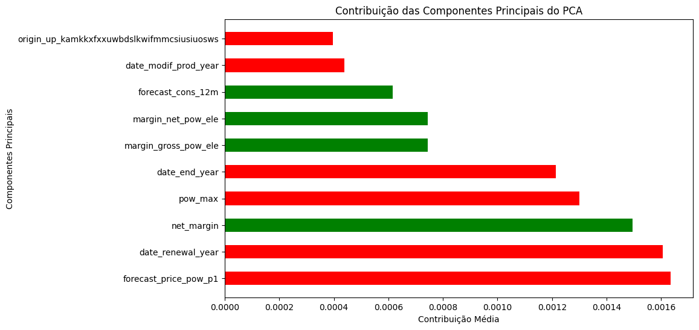
Fonte: Autoria Própria

&emsp;&emsp;O gráfico mostra as 10 variáveis mais importântes para o modelo no momento de realizar uma previsão. A que mais se destacou foi a previsão do preço da energia no primeiro período.

&emsp;&emsp;Uma das hipóteses iniciais era de que a margem líquida (net_margin) teria grande relevância para um cliente dar churn. Esta hipótese se confirmou e é uma alavanca acionável dentro da PowerCo. Esta variável tem correlação direta com o desconto, e sendo assim confirma a hipótese da PowerCo de que os clientes são sensíveis a preço.

## <a name="c5"></a>5. Conclusões e Recomendações

&emsp;&emsp;O projeto tinha como objetivo principal reduzir o churn na empresa PowerCo por meio da implementação de um modelo preditivo de classificação. Os dados utilizados para treinar o modelo foram fornecidos pela própria PowerCo e coletados de maneira ética e legal. O modelo XGBoost alcançou os seguintes resultados de desempenho:

Accuracy: 90.27%  
Precision: 79.57%  
Recall: 51.82%  
F1-score: 51.06%  
AUC-ROC: 71.28%  

&emsp;&emsp;As partes interessadas afetadas pelas decisões do modelo incluem a própria empresa PowerCo e seus clientes, que poderiam receber um serviço diferenciado. As implicações estratégicas incluem uma maior facilidade na tomada de decisão por parte dos analistas de contas, permitindo que eles identifiquem clientes com maior probabilidade de churn e implementem estratégias personalizadas para reter esses clientes.

Recomendações Formais:

&emsp;&emsp;Implementação Visual: Recomenda-se que a equipe de tecnologia da PowerCo implemente o modelo em uma interface visual, como uma aplicação web ou uma dashboard como PowerBi. Isso facilitará o uso do modelo pelos analistas de contas e tornará os resultados mais acessíveis.

&emsp;&emsp;Treinamento e Integração: A equipe de vendas e atendimento ao cliente deve ser treinada para entender e utilizar os resultados do modelo de forma eficaz. Além disso, é importante integrar os resultados do modelo ao processo de tomada de decisão, de modo que as recomendações sejam aplicadas de maneira consistente.

&emsp;&emsp;Ética e Privacidade: Certifique-se de que a utilização dos dados e do modelo seja conduzida de acordo com os mais altos padrões éticos e de privacidade. Isso inclui o tratamento adequado dos dados dos clientes e o cumprimento de regulamentações relevantes, como a Lei Geral de Proteção de Dados (LGPD).

&emsp;&emsp;Monitoramento Contínuo: Implemente um sistema de monitoramento contínuo do desempenho do modelo e dos resultados obtidos. Isso permitirá ajustes à medida que o modelo é utilizado na prática e garantirá que ele continue a ser eficaz ao longo do tempo.

&emsp;&emsp;Feedback dos Clientes: Estabeleça um canal de feedback para os clientes, permitindo que eles expressem preocupações ou dúvidas sobre o uso do modelo. Isso demonstrará um compromisso com a transparência e a ética.

&emsp;&emsp;Aprimoramento Contínuo: Esteja preparado para aprimorar o modelo com o tempo, incorporando mais dados e refinando os algoritmos à medida que novas informações se tornem disponíveis.

&emsp;&emsp;Essas recomendações visam garantir que o modelo preditivo seja implementado de maneira eficaz, ética e estratégica, beneficiando tanto a PowerCo quanto seus clientes. Além disso, a documentação adicional, como um manual de usuário detalhado, pode ser útil para garantir que a equipe possa usar o modelo com eficiência e compreender suas implicações.


## <a name="c6"></a>6. Referências

Disponível em: https://ufabcjr.com.br/metodologia-agil-analise-swot-2/ - acesso em: 11/09/2023.
² Disponível em: https://g4educacao.com/portal/value-proposition-canvas - acesso em: 11/09/2023.
³ Disponível em: https://pdf.blucher.com.br/designproceedings/9cidi/4.0246.pd - acesso em: 11/09/2023. 
⁴ Disponível em: https://aelaschool.com/pt/designdeinteracao/jornada-do-usuario-e-sua-importancia/ - acesso em: 11/09/2023.
⁵ONCASE. Explicabilidade de Modelos: Importância e o que é. Disponível em: https://www.oncase.com.br/blog/scora_journey/explicabilidade-de-modelos-importancia-e-o-que-e/. Acesso em: [02/10/2023].


## <a name="attachments"></a>Anexos

Não se aplica
